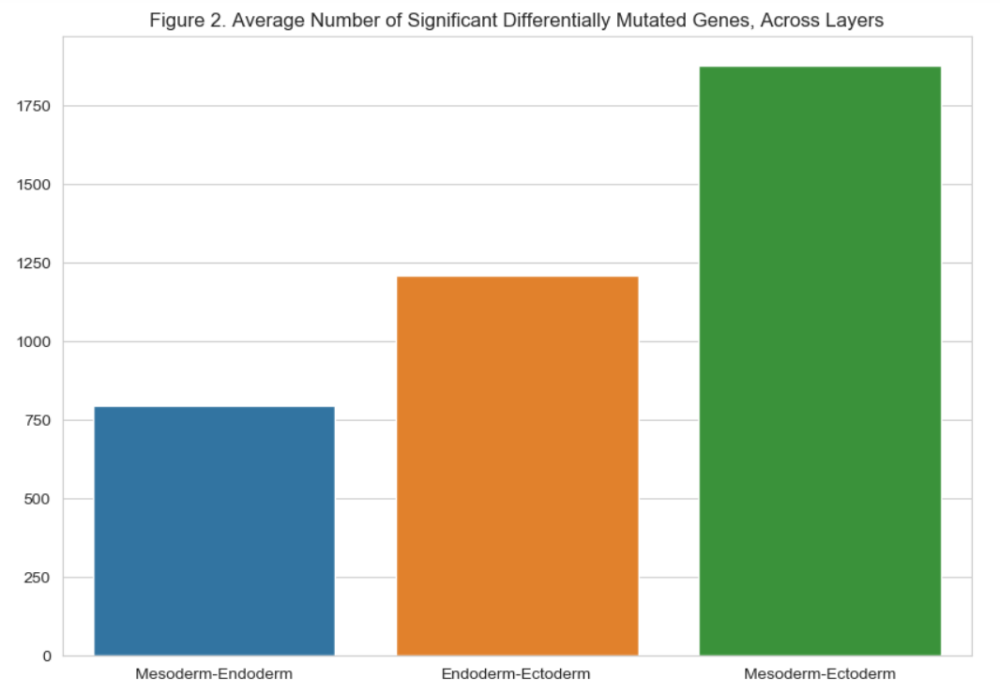
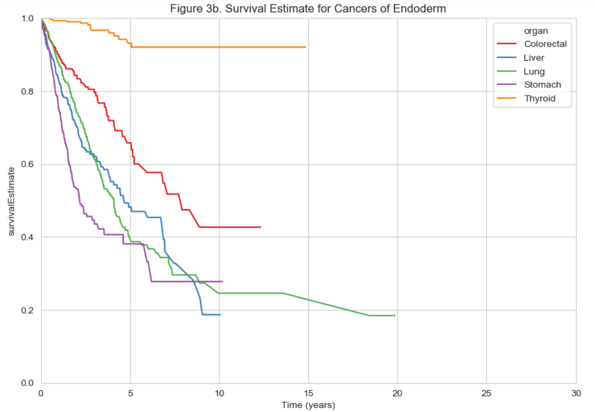
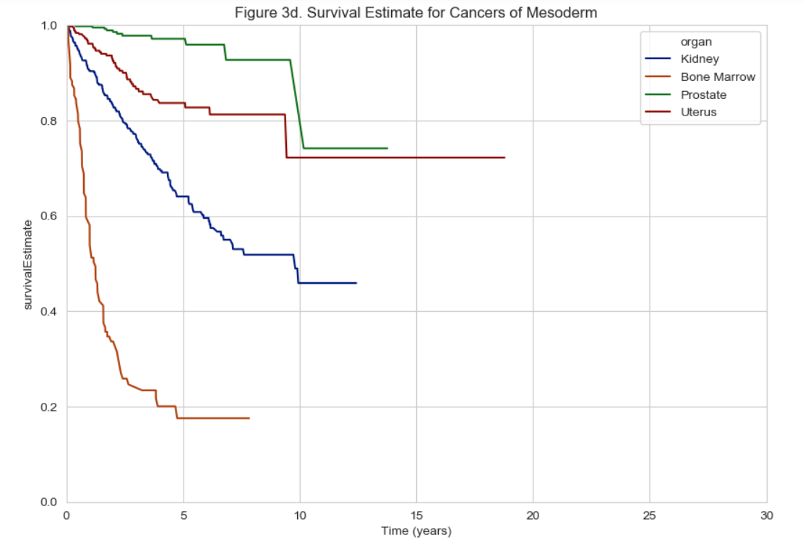
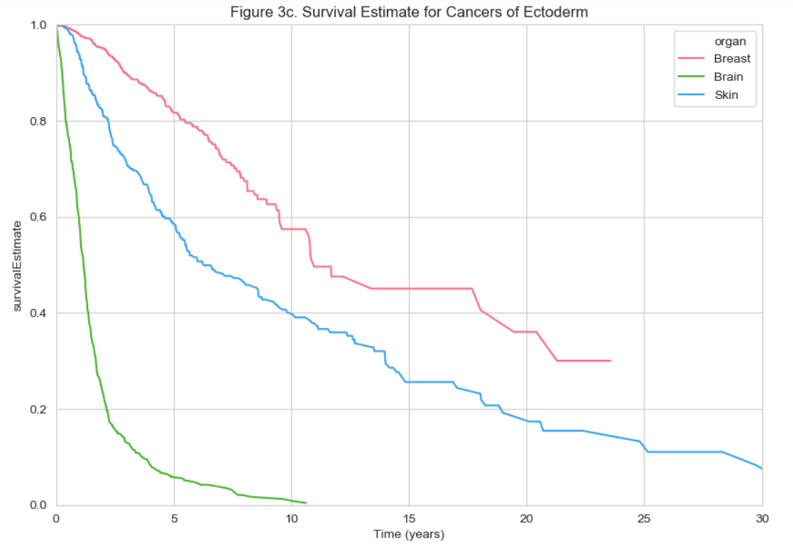

### Background
#### How is cancer related to genetics?
- Genetic mutations can be passed onto offspring and inheriting a damaged gene can put an individual at a higher risk for cancer
- Genetic changes can also occur during a person's lifetime (known as somatic mutations)
- Carcinogenic substances can damage DNA 
- Hard to understand genetics of cancer because most cancers are not liked to a specific gene
- Understanding how genetic changes affect cancer development is important because it can aid in prevention, prognosis, and treatment

#### Embryonic develpoment
- Gastrulation happens early on in development when a blastula transforms into a multicellular organism 
- The three layers that form are called germ layers and give rise to the internal structure of an organism 
- The layer of cells within a germ layer interact with each other

#### How are cancer and embryonic development related? 
- Human embryonic genes are expressed in cancer cells
- Genes that drive an embryo’s growth turn off after developing, but they appear to turn back on in many tumor cells
- Lack of research looking at the embryonic origins of cancer: cancer types could potentially be associated with the three different germ layers

### Hypothesis
- The endoderm and mesoderm will have similar structures as they were made in nearly identical processes during gastrulation
- Endoderm and mesoderm will have similar mutations & survival rates

### Methods
- Maftools were used for the majority of our analyses 
#### Part 1: Mutated Gene Similarities
 1. Gathered MAF files from organs with at least 200 samples
 2. Compared differentially mutated genes with maftools' mafCompare (add link)
#### Part 2: Survival Analysis
 1. Create survival plot (survival probability vs years after last followup) for each germ layer
 2. Used maftools' survGroup (ad link) to find genes associated with poor survival within each germ layer

### Results & Discussion

| Ectoderm  | Mesoderm | Endoderm |
| --------- | -------- | -------- |
|  |  |  |

### Conclusion
Was our hypothesis correct? What did we discover?