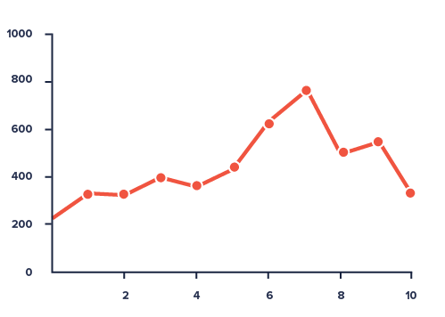

### Background
#### How is cancer related to genetics?
- Genetic mutations can be passed onto offspring and inheriting a damaged gene can put an individual at a higher risk for cancer
- Genetic changes can also occur during a person's lifetime (known as somatic mutations)
- Carcinogenic substances can damage DNA 
- Hard to understand genetics of cancer because most cancers are not liked to a specific gene
- Understanding how genetic changes affect cancer development is important because it can aid in prevention, prognosis, and treatment

### Hypothesis
- Endoderm and mesoderm will have similar mutations & survival rates
- The endoderm and mesoderm have similar structures as they were made in nearly identical processes during gastrulation

### Methods
What did we do to answer our hypothesis?

### Results & Discussion
Here is where all the viz and tables go

### Conclusion
Was our hypothesis correct? What did we discover?