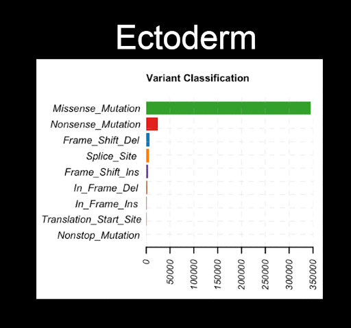

### Background
#### How is cancer related to genetics?
- Genetic mutations can be passed onto offspring and inheriting a damaged gene can put an individual at a higher risk for cancer
- Genetic changes can also occur during a person's lifetime (known as somatic mutations)
- Carcinogenic substances can damage DNA 
- Understanding how genetic changes affect cancer development is important because it can aid in prevention, prognosis, and treatment

#### Embryonic develpoment
- Gastrulation happens early on in development when a blastula transforms into a multicellular organism 
- The three layers that form are called germ layers and give rise to the internal structure of an organism 
- The layer of cells within a germ layer interact with each other

#### How are cancer and embryonic development related? 
- Human embryonic genes are expressed in cancer cells
- Genes that drive an embryo’s growth turn off after developing, but they appear to turn back on in many tumor cells
- Lack of research looking at the embryonic origins of cancer: cancer types could potentially be associated with the three different germ layers

### Hypothesis
- The endoderm and mesoderm will have similar structures as they were made in nearly identical processes during gastrulation
- Endoderm and mesoderm will have similar mutations & survival rates

### Methods
- Maftools were used for the majority of our analyses 
#### Part 1: Mutated Gene Similarities
 1. Gathered MAF files from organs with at least 200 samples
 2. Compared differentially mutated genes with maftools' mafCompare (add link)
#### Part 2: Survival Analysis
 1. Create survival plot (survival probability vs years after last followup) for each germ layer
 2. Used maftools' survGroup (ad link) to find genes associated with poor survival within each germ layer

### Results & Discussion

- Figure shows that the mutations between endoderm and mesoderm had the SMALLEST number of significant differentially mutated genes 
- Mesoderm and endoderm have the MOST genes that share a similar distribution
- Supports our hypothesis that mesoderm and endoderm have similar mutations

  

|  |  |  |
| --------- | -------- | -------- |
|  |  |  |
- Missense mutation: a change in one DNA base pair that results in the substitution of one amino acid for another in the protein made by a gene
- Nonsense mutation: point mutations in a sequence of DNA that results in a premature stop codon. Results in a shortened protein that may function improperly or not at all
- Missense mutations most common for all three layers
- Nonsense mutations are the second most common mutations for ectoderm and mesoderm 
- Endoderm has a higher proportion of frameshift deletions than ectoderm and mesoderm; are more harmful mutations than most

  

  
  
   

- Oncoplots look at the top 10 mutated genes for each sample
- Found that all layers share 3/10 top mutated genes: TTN, MUC16, and P53 
- Mesoderm has the largest percentage of mutations that are multi-hit for the top 10 mutated genes 
- Endoderm has mutations that are altered in 81.41% of the samples, which is the highest ratio
- We expected mesoderm to have a similar percentages of genes that were altered, but found that mesoderm was only 65%
- Endoderm having a higher variants per sample and the higher amount of frame shift deletions shows that mutations in the endoderm do not appear to be similar to that of mesoderm

  

- Ectoderm has the worst survival probability at every time point
- Mesoderm has the highest survival probability
- Endoderm had similar probabilities to ectoderm at 5 and 10 years; however still has higher survival probability than endoderm
- We were expecting endoderm and mesoderm, but ectoderm ended up with the lowest probability

  

| Ectoderm  | Mesoderm | Endoderm |
| --------- | -------- | -------- |
|  |  |  |
- Ectoderm plot show that the brain significantly changed the survival probability of the layer
- Endoderm plot organs have very similar survival probabilities, with exception of thyroid
- Mesoderm plot organs are spread out relatively evenly

  

- NOTE: If the ratio is 1 that means that the risks are the same. If it is greater than 1, then the risk is higher, and vice versa. An ratio of 1.5 means that the risk of dying is higher by 50%
- Only chose the top 6 genes based on hazard ratios 
- Endoderm consistently has the highest hazard ratio over one, two and three gene combinations
- Although we only showed top 6, for the three gene combination there were 28 different combinations  in the endoderm with a hazard ratio > 1
- Mesoderm and ectoderm typically has lower hazard ratio for all gene combinations
- Mesoderm and endoderm do not have similar hazard ratios, contrary to our hypothesis

### Conclusion
- The survival rates for mesoderm and endoderm were less related than other combinations of layers
- Closely related germ layers do not have similar survival rates (no correlation)
- Differing Results:
    - Ectoderm and mesoderm showed LOWER hazard ratios overall than endoderm; would expect endoderm to have worst survival estimate
    - Survival plot shows ectoderm has worst survival estimate
- Hypothesis supported in that endoderm and mesoderm share the most mutation similarity, but unsupported in that survival rates do not correlate with similar mutations
